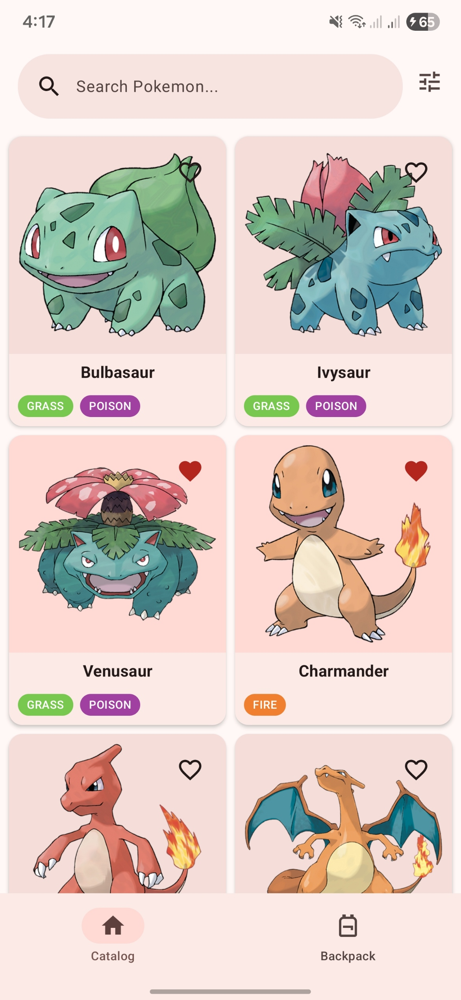
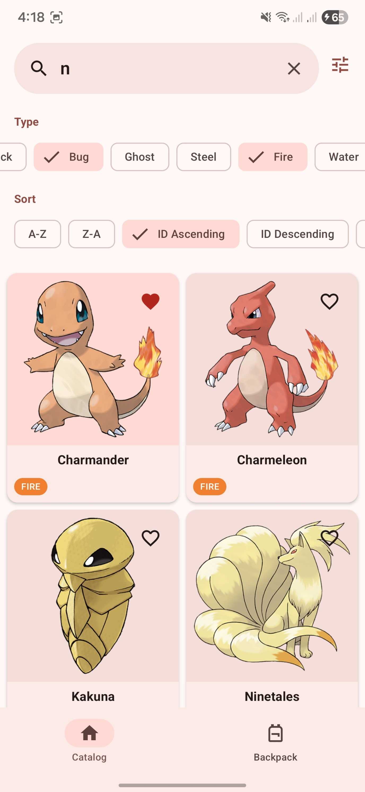
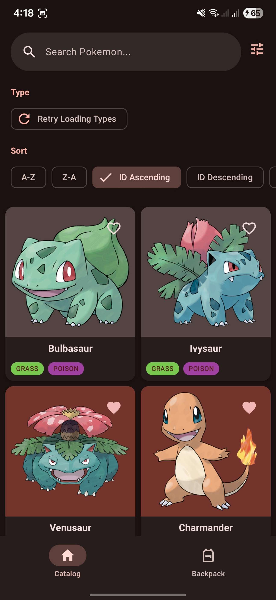
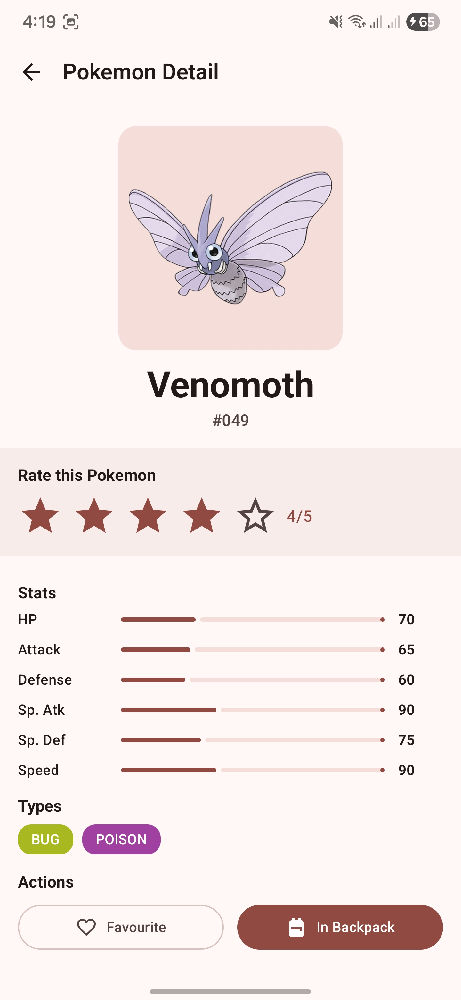
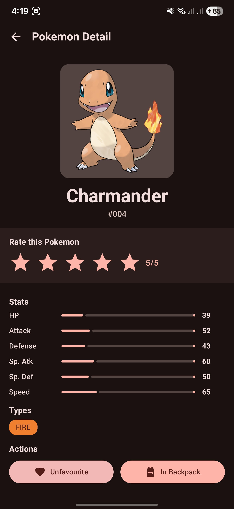
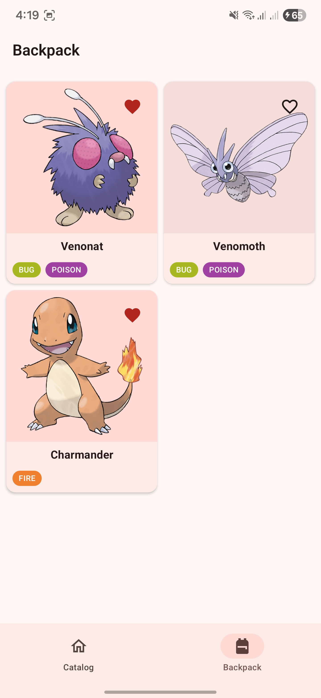
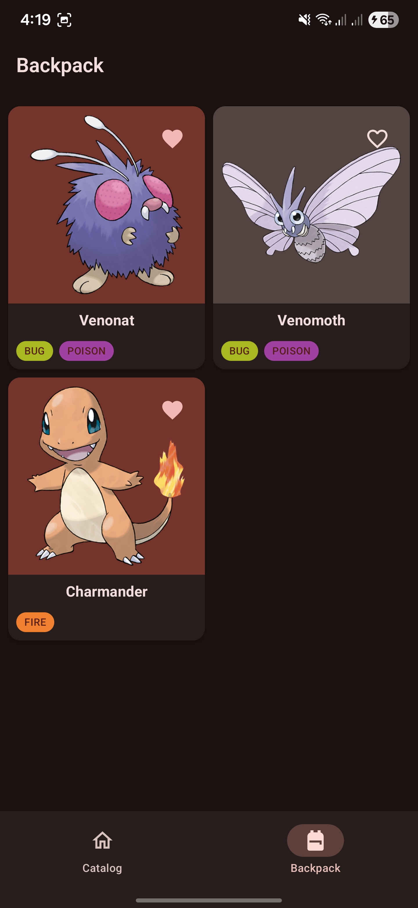

# Pokémon App

## Table of Contents

- [Overview](#overview)
- [Features](#features)
- [Architecture](#architecture)
- [Tech Stack](#tech-stack)
- [Installation](#installation)
- [Project Structure](#project-structure)
- [API Usage](#api-usage)
- [Assumptions & Limitations](#assumptions--limitations)
- [App Preview](#app-preview)

---

## Overview

This is a native Android application built with **Kotlin** and **Jetpack Compose** that displays all 151 Generation 1 Pokémon using live data from the [PokéAPI](https://pokeapi.co/). The app demonstrates modern Android development practices with clean architecture, MVVM pattern, and reactive programming.

### Key Highlights

- **Modern UI**: Built entirely with Jetpack Compose and Material 3
- **Clean Architecture**: Multi-module project with clear separation of concerns
- **Offline-First**: Room database with RemoteMediator for seamless offline experience
- **Performance**: Paging 3 for efficient data loading and memory management
- **Reactive**: Kotlin Flow and StateFlow for reactive data streams
- **Dependency Injection**: Hilt for scalable DI
- **Type-Safe Navigation**: Kotlin Serialization with Navigation Compose

---

## Features

### 1. Pokémon Catalogue

The main screen displaying all 151 Generation 1 Pokémon with rich functionality:

- **Browse All Pokémon**: View all Generation 1 Pokémon in a responsive 2-column grid
- **Search by Name**: Real-time search with instant results
- **Type Filtering**: Filter Pokémon by type (Fire, Water, Grass, Electric, etc.)
  - Multiple type selection supported
  - Visual indication of active filters
  - Dynamic type loading with retry mechanism
- **Sorting Options**:
  - By ID (Ascending/Descending)
  - By Name (A-Z/Z-A)
  - By Type
- **Infinite Scroll**: Automatic pagination with smooth loading
- **Offline Support**: Browse cached data without internet connection
- **Quick Actions**: Add to favorites or backpack directly from catalog

**Display Information:**

- Pokémon name
- Pokémon types with color-coded badges
- High-quality official artwork
- Favorite indicator

### 2. Pokémon Detail Screen & Backpack Management

Comprehensive Pokémon information with full collection management:

**Pokémon Information:**

- Name and ID
- High-resolution image
- Type badges with color coding
- Base stats (HP, Attack, Defense, Special Attack, Special Defense, Speed)
- Visual stat bars with percentages

**Collection Management (Actions available in Detail Screen):**

- **Add/Remove from Backpack**: Toggle button to manage your collection
- **Mark as Favorite**: Star your favorite Pokémon with heart icon
- **Rate Pokémon**: 5-star rating system
- **Persistent Storage**: All data persists across app restarts
- **Real-time Updates**: Changes reflect instantly across all screens

**Backpack Screen:**

- View your personal collection of Pokémon
- Display all catalog information (name, types, image)
- Show favorite status and rating
- Empty state when collection is empty
- Remove from collection with smooth animations

**UI/UX:**

- Smooth animations
- Scroll-reactive AppBar
- Loading states with skeleton screens
- Error handling with retry
- Offline support

### 3. Additional Features

- **Material 3 Design**: Modern Material You design system
- **Dark Mode Support**: Automatic theme switching
- **Smooth Animations**: Item animations and transitions
- **Image Caching**: Efficient image loading with Coil
- **Error Handling**: User-friendly error messages with retry
- **Loading States**: Proper loading indicators throughout
- **Scroll State Preservation**: Maintains scroll position on navigation
- **Build Variants**: Separate Dev and Production configurations

---

## Architecture

This project follows **Clean Architecture** principles with a pragmatic Android approach, organized into multiple modules for scalability and maintainability.

### Architecture Layers

```
┌─────────────────────────────────────────────┐
│          Presentation Layer                 │
│    (UI, ViewModels, Compose Screens)        │
│        feature:catalog                      │
│        feature:detail                       │
│        feature:backpack                     │
└─────────────────┬───────────────────────────┘
                  │
┌─────────────────▼───────────────────────────┐
│          Domain Layer                       │
│    (Business Logic, Models, Repository)     │
│        core:domain                          │
└─────────────────┬───────────────────────────┘
                  │
┌─────────────────▼───────────────────────────┐
│          Data Layer                         │
│    (Repository Impl, API, Database)         │
│        core:data                            │
└─────────────────────────────────────────────┘
```

### MVVM Pattern

- **Model**: Domain entities and repository interfaces
- **View**: Composable functions (screens and components)
- **ViewModel**: State management and business logic coordination

### Key Architectural Decisions

1. **Multi-Module Structure**:

   - `core:common` - Shared utilities and base classes
   - `core:domain` - Business logic and domain models
   - `core:data` - Data sources and repository implementations
   - `core:ui` - Shared UI components and theme
   - `feature:catalog` - Pokémon list feature
   - `feature:detail` - Pokémon detail feature
   - `feature:backpack` - User collection feature

2. **Dependency Rule**: Dependencies only flow inward (feature → domain → data)

3. **Single Source of Truth**: Room database as the single source of truth

4. **Offline-First**: All data cached locally for offline access

5. **Pragmatic Approach**: `PagingData` in domain layer for Android-only app

---

## Tech Stack

### Core Technologies

- **Language**: Kotlin
- **UI Framework**: Jetpack Compose
- **Design System**: Material 3
- **Min SDK**: 24 (Android 7.0)
- **Target SDK**: 35 (Android 15)

### Architecture & Patterns

- **Architecture**: Clean Architecture + MVVM
- **Dependency Injection**: Hilt
- **Navigation**: Navigation Compose
- **Serialization**: Kotlin Serialization

### Data & Networking

- **Networking**: Retrofit
- **HTTP Client**: OkHttp
- **JSON**: Kotlinx Serialization
- **Database**: Room
- **Pagination**: Paging 3

### Async & Reactive

- **Coroutines**: Kotlin Coroutines
- **Reactive Streams**: Kotlin Flow
- **State Management**: StateFlow

### UI & Image Loading

- **Image Loading**: Coil
- **Icons**: Material Icons Extended
- **Compose**: Full Compose BOM with UI, Material3, Navigation

---

## Installation

### Prerequisites

- **Android Studio**: Ladybug | 2024.2.1 or later
- **JDK**: 11 or higher
- **Minimum Android Version**: Android 7.0 (API 24)
- **Internet Connection**: Required for initial data fetch

### Setup Steps

1. **Clone the repository**

   ```bash
   git clone https://github.com/baharudin-yusup/pokemon-android-compose.git
   cd pokemon-android-compose
   ```

2. **Open in Android Studio**

   - Open Android Studio
   - Select "Open an Existing Project"
   - Navigate to the cloned directory
   - Click "OK"

3. **Sync Gradle**

   - Android Studio will automatically sync Gradle
   - Wait for the sync to complete
   - Resolve any SDK or dependency issues if prompted

4. **Build the project**

   ```bash
   ./gradlew build
   ```

5. **Run the app**
   - Select a build variant (`devDebug` or `productionDebug`)
   - Click the "Run" button or press Shift+F10
   - Choose a connected device or emulator

## Project Structure

```
PokemonCompose/
├── app/                          # Application module
│   ├── src/main/
│   │   ├── AndroidManifest.xml
│   │   └── java/.../pokemon_compose/
│   │       ├── MainActivity.kt
│   │       ├── PokemonApplication.kt
│   │       └── navigation/
│   │           └── NavGraph.kt
│   └── build.gradle.kts
│
├── core/                         # Core modules
│   ├── common/                   # Shared utilities
│   │   └── src/main/
│   │       ├── util/             # Constants, Extensions, Result
│   │       └── logger/           # Logging interface
│   │
│   ├── domain/                   # Business logic
│   │   └── src/main/
│   │       ├── model/            # Domain models (Pokemon, PokemonDetail)
│   │       └── repository/       # Repository interfaces
│   │
│   ├── data/                     # Data layer
│   │   └── src/main/
│   │       ├── local/            # Database (Room)
│   │       │   ├── database/     # Database & DAOs
│   │       │   ├── entity/       # Database entities
│   │       │   └── converter/    # Type converters
│   │       ├── remote/           # Network (Retrofit)
│   │       │   ├── api/          # API service interfaces
│   │       │   └── dto/          # Data transfer objects
│   │       ├── mapper/           # Data mappers
│   │       ├── paging/           # RemoteMediator
│   │       ├── repository/       # Repository implementations
│   │       ├── network/          # Interceptors
│   │       └── di/               # Dependency injection
│   │
│   └── ui/                       # Shared UI components
│       └── src/main/
│           ├── theme/            # Theme, Colors, Typography
│           └── components/       # Reusable composables
│
└── feature/                      # Feature modules
    ├── catalog/                  # Pokemon list & search
    │   └── ui/
    │       ├── CatalogScreen.kt
    │       ├── CatalogViewModel.kt
    │       └── components/       # Feature-specific components
    │
    ├── detail/                   # Pokemon details
    │   └── ui/
    │       ├── DetailScreen.kt
    │       ├── DetailViewModel.kt
    │       └── components/
    │
    └── backpack/                 # User collection
        └── ui/
            ├── BackpackScreen.kt
            └── BackpackViewModel.kt
```

---

## API Usage

### PokéAPI Integration

This app uses the official [PokéAPI](https://pokeapi.co/) - a free RESTful Pokémon API.

**Base URL**: `https://pokeapi.co/api/v2/`

### Endpoints Used

1. **List Pokémon** (with pagination)

   ```
   GET /pokemon?offset={offset}&limit={limit}
   ```

   - Used for: Initial data load and pagination
   - Limit: 20 Pokémon per page
   - Returns: List of Pokémon with basic info

2. **Get Pokémon Details**

   ```
   GET /pokemon/{id}
   ```

   - Used for: Detailed Pokémon information
   - Returns: Complete Pokémon data (stats, abilities, types, etc.)

3. **Get Pokémon Types**
   ```
   GET /type
   ```
   - Used for: Loading available types for filtering
   - Returns: List of all Pokémon types

---

## Assumptions & Limitations

### Assumptions

1. **Pokemon Generation 1**: App assumes Generation 1 Pokémon are IDs 1-151

2. **Device Requirements**:

   - Minimum Android 7.0 (API 24)
   - Recommended 2GB+ RAM for smooth performance
   - Storage space for database and image cache

### Current Limitations

1. **Local Filtering & Sorting**: Search, filter, and sort operations are handled locally on cached data

   - Search by name: performed on local database, not via API
   - Type filtering: filters cached Pokémon data locally
   - Sorting: sorts local data, not requesting sorted data from API
   - Limitation: Only works on data that has been fetched and cached

---

## App Preview

### Catalog Screen

<table>
  <tr>
    <td></td>
    <td></td>
    <td></td>
  </tr>
  <tr>
    <td align="center"><i>Catalog - Light Mode</i></td>
    <td align="center"><i>Filter & Sort - Light</i></td>
    <td align="center"><i>Filter & Sort - Dark</i></td>
  </tr>
</table>

### Detail Screen

<table>
  <tr>
    <td></td>
    <td></td>
  </tr>
  <tr>
    <td align="center"><i>Pokemon Detail - Light Mode</i></td>
    <td align="center"><i>Pokemon Detail - Dark Mode</i></td>
  </tr>
</table>

### Backpack Screen

<table>
  <tr>
    <td></td>
    <td></td>
  </tr>
  <tr>
    <td align="center"><i>User Collection - Light Mode</i></td>
    <td align="center"><i>User Collection - Dark Mode</i></td>
  </tr>
</table>
